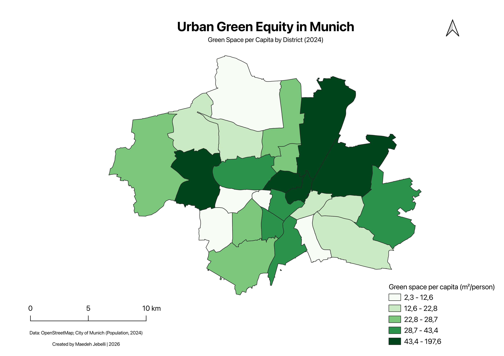

# Urban Green Equity in Munich

A GIS-based spatial analysis of **urban green-space availability across Munich's 25 city districts**, examining how green-space provision varies relative to district population.

The project was developed in **QGIS** and combines administrative boundaries, OpenStreetMap green-space data, and district-level population statistics to calculate and visualize **green space per capita (m²/person)**.

## Project Overview

Comparing the total amount of green space between districts can be misleading because population sizes differ substantially.

This project therefore uses a population-normalized indicator:

**Green Space per Capita = Green Space Area / Population**

This allows the 25 city districts of Munich to be compared based on the amount of mapped green space available per resident.

## Objectives

- Map urban green spaces across Munich
- Work with Munich's 25 administrative city districts
- Calculate green-space area by district
- Integrate district-level population data
- Calculate green space per capita in m²/person
- Compare spatial differences between districts
- Visualize the results using thematic cartography

## Tools & Technologies

- QGIS
- OpenStreetMap / QuickOSM
- Vector spatial analysis
- Spatial and attribute joins
- Geometry calculations
- Field Calculator
- Graduated symbology
- QGIS Print Layout

**Coordinate Reference System:**  
`EPSG:25832 – ETRS89 / UTM zone 32N`

A projected coordinate reference system was used to support area calculations in metric units.

## Data

The analysis combines three main datasets:

### Administrative Boundaries

Polygon boundaries representing Munich's **25 city districts (Stadtbezirke)**.

### Urban Green Spaces

Green-space polygons derived from **OpenStreetMap** and processed in QGIS.

### Population

District-level population data for Munich for **2024**, joined to the administrative district layer.

## Methodology

### 1. Prepare Administrative Districts

Administrative boundary data were imported into QGIS and processed to obtain one polygon for each of Munich's 25 city districts.

District geometries were dissolved where necessary using district identifiers.

### 2. Prepare Green-Space Data

Green-space polygons were imported and processed in QGIS.

Geometry calculations were performed using `EPSG:25832`, allowing green-space areas to be measured in square metres.

### 3. Calculate Green Space by District

Spatial operations were used to associate green-space geometries with Munich's administrative districts.

Green-space areas were summarized to calculate the total mapped green-space area within each district.

### 4. Integrate Population Data

Population statistics were joined to the district polygons using district identifiers.

The resulting dataset contains both:

- total green-space area
- district population

### 5. Calculate Green Space per Capita

A population-normalized indicator was calculated:

`green_pc = green_space_area / population`

The resulting value represents the amount of mapped green space in **m² per person** for each district.

### 6. Visualize the Results

The `green_pc` indicator was visualized using graduated symbology.

Districts were classified into five classes representing relatively low to high levels of green-space availability per resident.

The final cartographic layout includes:

- Thematic map
- Five-class legend
- Scale bar
- North arrow
- Title and subtitle
- Data-source information

## Results

The analysis shows clear spatial variation in green-space availability across Munich.

Green-space-per-capita values range approximately from **2.3 m²/person to 197.6 m²/person**.

The results illustrate why total green-space area alone is not sufficient for comparing districts: differences in population substantially affect the amount of green space available per resident.

## Final Map



The final map presents **green space per capita by district for 2024**, using a five-class graduated color scheme.

## Key Skills Demonstrated

- GIS spatial analysis
- QGIS
- Spatial data processing
- Vector geoprocessing
- Spatial joins
- Attribute joins
- Geometry and area calculations
- Population-normalized indicators
- Thematic cartography
- Coordinate reference systems
- Map design and visualization

## Limitations

This analysis provides an exploratory measure of green-space availability rather than a complete assessment of accessibility or environmental equity.

The indicator measures the quantity of mapped green space within each district but does not account for factors such as walking distance, park accessibility, vegetation quality, facilities, or inequalities within individual districts.

OpenStreetMap coverage may also vary across different types of urban green space.

## Repository Structure

```text
Munich-urban-green-equity/
├── README.md
├── qgis/
│   └── Urban-Green-Equity-Munich.qgz
└── outputs/
    └── Munich-Urban-Green-Equity.png
```

## Author

**Maedeh Jebelli**  
Geomatics Engineering · GIS · Geospatial Data Analysis
